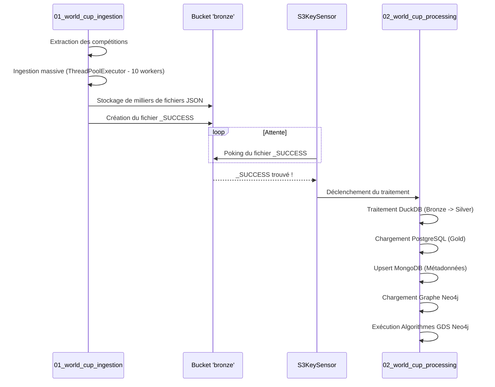
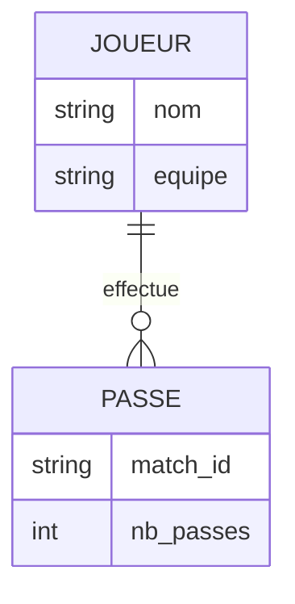

# Architecture & Flux de Données - Pitch Intelligence Graphs

Ce document détaille l'architecture globale, les pipelines de données et la modélisation choisie pour le projet de réseaux de passes.

## 1. Architecture Globale (Medallion Architecture)

Le projet repose sur une architecture moderne de type "Médaillon", divisée en trois couches logiques (Bronze, Silver, Gold). L'infrastructure entière tourne sous Docker Compose.

```mermaid
flowchart TD
    %% Sources
    API[StatsBomb Open Data JSON]

    %% Ingestion (Membre A)
    subgraph Bronze Layer
        direction TB
        AF(Airflow Orchestrator)
        S3[(MinIO Object Storage)]
        AF -- Ingestion Multithread --> S3
    end

    %% Processing (Membre B & C)
    subgraph Processing Layer
        direction TB
        DDB(DuckDB)
        MG[(MongoDB - Métadonnées)]
        N4J[(Neo4j - Graphe & GDS)]
        PG[(PostgreSQL - Relational)]
    end

    %% Visualization (Membre C)
    subgraph BI Layer
        SP[Apache Superset]
    end

    %% Flux
    API -->|HTTP GET| AF
    S3 -->|JSON Brut| DDB
    DDB -->|Nettoyage & Agrégation| S3
    
    S3 -->|Parquet Silver| PG
    S3 -->|Parquet Silver| MG
    S3 -->|Parquet Silver| N4J

    PG -->|SQL (Couche Gold)| SP
    N4J -->|Cypher Top 5| SP

    classDef storage fill:#f9f,stroke:#333,stroke-width:2px;
    classDef processing fill:#bbf,stroke:#333,stroke-width:2px;
    classDef visualization fill:#fbf,stroke:#333,stroke-width:2px;
    
    class S3,MG,N4J,PG storage;
    class AF,DDB processing;
    class SP visualization;
```

---

## 2. Orchestration des DAGs Airflow

Afin d'optimiser le temps de traitement et d'assurer une exécution séquentielle, l'orchestration est séparée en deux DAGs qui communiquent via un capteur d'événements (S3KeySensor).



---

## 3. Modélisation Orientée Graphe (Neo4j)

La structure du réseau de passes est modélisée sous forme de graphe orienté. Les nœuds représentent les joueurs et les arêtes (relations) représentent les passes réussies entre eux.



### Algorithmes Graph Data Science (GDS)

Notre pipeline utilise deux algorithmes clés exécutés automatiquement en mémoire par le plugin GDS de Neo4j :

1. **PageRank** :
   * **Objectif** : Mesurer l'influence et la centralité de degré d'un joueur dans le réseau.
   * **Sens Métier** : Un joueur avec un PageRank élevé est souvent la "plaque tournante" de l'équipe, le maître à jouer par qui tous les ballons transitent avant de devenir dangereux.

2. **Betweenness Centrality (Intermédiarité)** :
   * **Objectif** : Identifier les nœuds qui servent de pont entre différentes parties du graphe.
   * **Sens Métier** : Détecte les joueurs indispensables à la transition défense-attaque, souvent les milieux récupérateurs/relayeurs sans qui le bloc équipe est scindé en deux.

---

## 4. Tableau de Bord (BI)

La couche Gold est exposée via **Apache Superset**, branché sur la base de données PostgreSQL. 

La table agrégée servie à Superset possède le schéma suivant :

| Colonne | Type | Description |
| :--- | :--- | :--- |
| `match_id` | STRING | Identifiant unique du match |
| `passeur_nom` | STRING | Nom du joueur effectuant la passe |
| `receveur_nom` | STRING | Nom du joueur recevant la passe |
| `equipe` | STRING | Equipe des deux joueurs |
| `nombre_passes` | INTEGER | Volume d'échanges (Poids de la relation) |

Cette modélisation en étoile simple permet de réaliser des Diagrammes en Barres (Top Passeurs), des Treemaps de la possession de balle, ou encore des Camemberts par équipe, le tout avec un temps de réponse de l'ordre de la milliseconde grâce aux index PostgreSQL.
